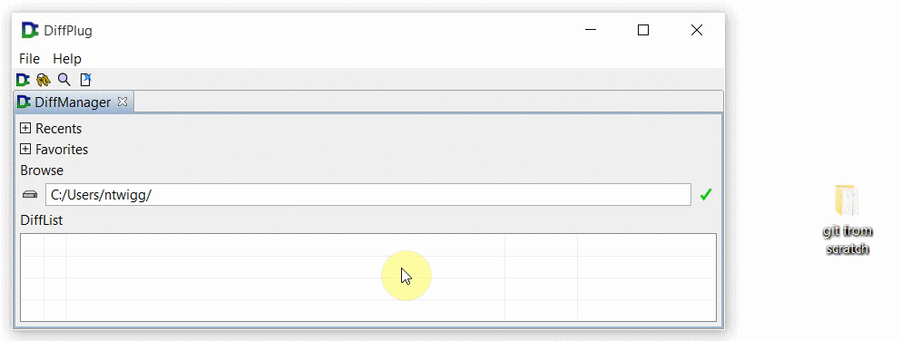
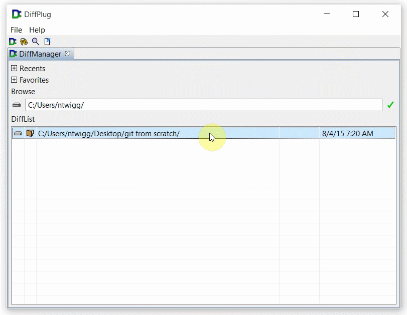

### Create a new repository

Git tracks all of the files which are contained by a folder (including sub-directories, sub-sub-directories, etc).  The first step when you create a new project is to pick the root folder.  I'll be using the source code to this repository as an example, but you can use whatever folder you'd like to start tracking.  Drag the folder to the DiffManager:

Then `right-click -> Git -> Create new`.

Now that you've got an empty repository, you can start [making commits](MakeCommit.md).
