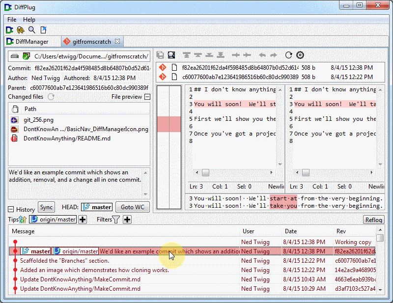
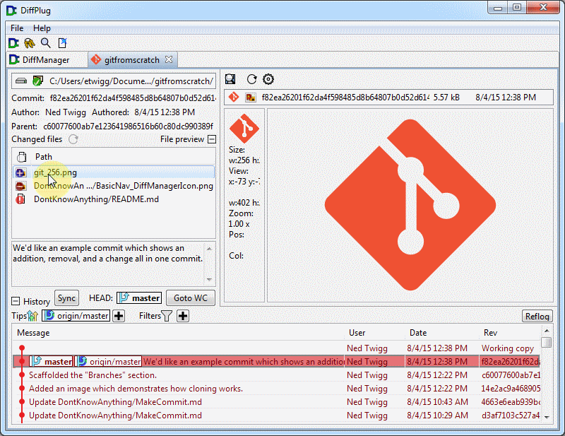

### Make a commit

**A commit is a snapshot of every single file in your project folder**, along with some metadata such as when the commit was made, who made it, and a short message describing the reasoning behind the work.  **A repository is just a pile of commits** - you can compare the files in one commit to another, search through the commits to see when a certain change was made, whatever!

The commits that are already in your repository are shown down here.  If you just created an empty repository, then you won't have much to look at yet, but you will soon!

If you click a commit, you can see all the files that were created, deleted, or changed between that commit and its previous files.

You can also see metadata about who made the commit, when, and why.

Now, you're going to make your own commit.  In the list of commits at the bottom, there is always a special row for the "working copy".  *The working copy is a draft of the next commit you're going to make*.  If you're looking at the working copy, then this button will say "Commit".  If it doesn't say "Commit", then it will say "Go to WC", and if you click it, it will take you to the working copy.

Once you're at the working copy, the "Changed files" section will show you which files you have modified in your project directory.  To make sure that it is up-to-date, you can hit the refresh button.

