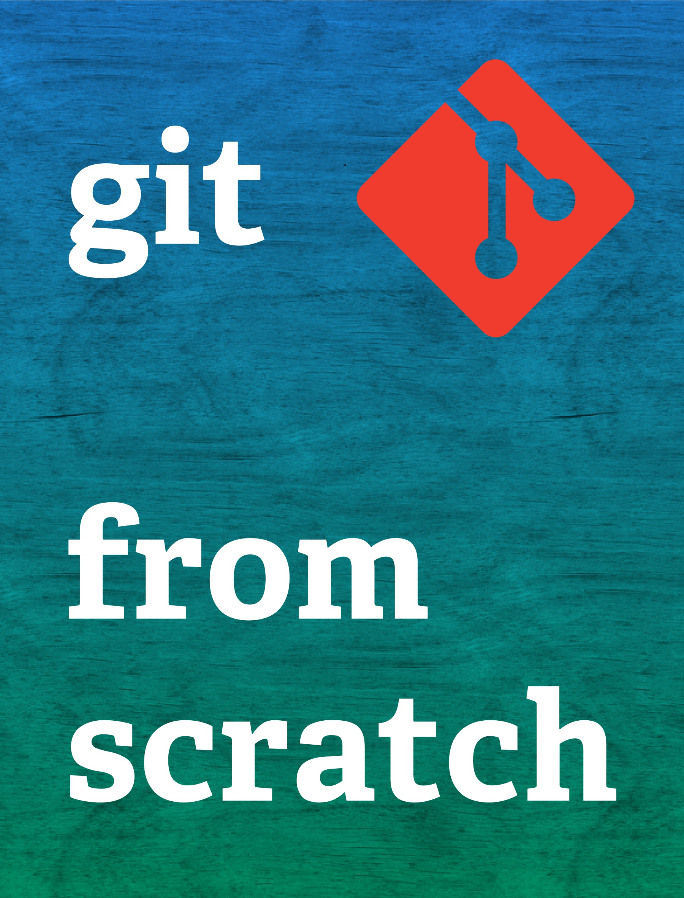

# Git from scratch

This git repository stores a book which will help you learn how to use git on code as well as Simulink and other kinds of file.  It is licensed under [CC BY-SA 4.0](https://creativecommons.org/licenses/by-sa/4.0/), which means you can remix it however you like, so long as you provide attribution and license your work in the same way.

- [Published version](https://www.gitfromscratch.com/)
- [Table of contents](manuscript/SUMMARY.md)
- [Read markdown](manuscript/README.md)
