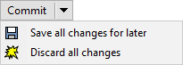

# Save work for later

It's common to make some changes in your working copy that end up looking like a dead end. It's tempting to just delete them and start over, but git makes it so easy to save them for later.

When you right-click a changed file or files in your working copy and select `Save changes for later`, DiffPlug will

- create a new branch
- commit those changes to the new branch branch
- remove those changes from your current working copy

This gives you a fresh start, but you still have easy access to your work-in-progress. To restore the work, just right-click the commit and select `Apply delta`. Once you are accustomed to throwing work away with the confidence that you can get it back in just a few seconds, you'll find that it's easier to try new things.

There *is* a chance that `Apply delta` will fail. That's okay, you'll still have the both versions available, and you can manually copy-paste the work back over. We'll go into the details of when and how this fails in the [time-travel section](../../time-travel/). But first, let's talk about [sharing your work with others](../../share).

*Hint 1: To quickly save all files in the working copy, you can use the dropdown next to Commit.*

*Hint 2: If you're an experienced git user who already uses the "git stash" command, see the [departures from vanilla git](../../epilogue/departures) section for more info.*
