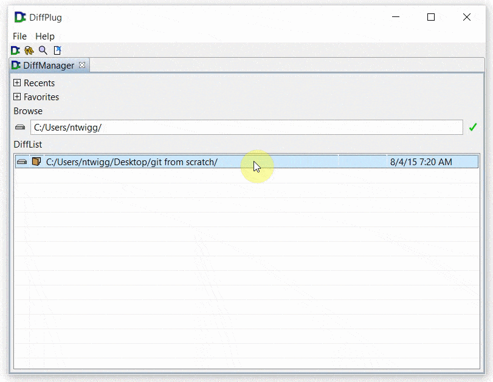

# Erm, what's a working copy?  Where do I get one?

Let's say you've got a folder on your computer.  Each time you make a meaningful change, you make zip copy of the folder, and name these copies `v1.zip`, `v2.zip`, etc.  Git is just an easier way to do that.

The folder that you're tracking, that's the "working copy".  The pile of `v1.zip` and `v2.zip` files is the "repository".  Git also has a feature where you can upload and download versions between the repository on your computer and a repository on someone else's computer - a repository on someone else's computer is called a "remote".

In concrete terms:

- **working copy** - a folder on your computer whose changes you are tracking
- **repository** - a hidden folder named `.git` inside the working copy which is keeping copies of all the versions of the working copy that you have saved
- **remote** - a repository on someone else's computer, you can download versions from it and upload versions to it

There's two ways to start - you can clone an existing repository from the internet, or you can create a brand new one on your computer.  When you're first learning about git it's probably easier to tinker with a clone.

## Clone an existing repository

Copying a repository from someone else's computer onto yours is called "cloning".  There are two things you're going to need:

1. The URL you want to clone from
	+ This acts like the "phone number" which git will call to ask for the latest version.
	+ Later on, we'll show you how to upload changes you make to this URL.
	+ If you want a toy project, use `https://github.com/diffplug/gitfromscratch` as your URL - it's the actual source to this website!
2. The folder on your computer where you're going to put the clone

Go to wherever you'd like to put your clone, and `right-click -> Git -> Clone`.  This will open a dialog where you can put the URL, and DiffPlug is happy to make a new destination folder for you if you want.  Once the download completes, you'll have your shiny new clone.

*Hint: You can't put a git repository inside another repository.  If you don't see `Clone` as an option, you're probably inside an existing repository, and you need to move up to a higher folder.*

Now that you've got a working copy, you can start [making commits](../make-a-commit/).

## Create a brand new repository

To take a folder and start tracking it, just right-click it and then `Git -> Create new`.

*Hint: You can't put a git repository inside another repository.  If you don't see `Create new` as an option, you're probably inside an existing repository, and you need to move up to a higher folder.*

Now that you've got an empty repository, you can start [making commits](../make-a-commit/).
