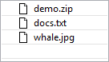
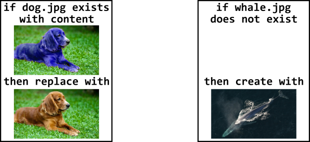
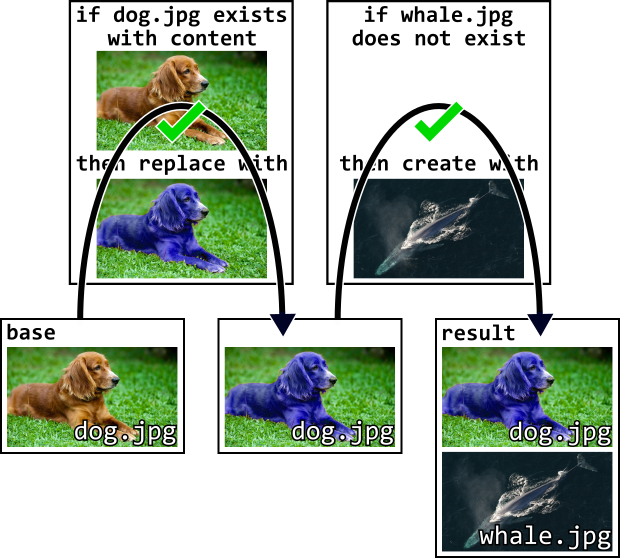

# Patches are the "flux capacitor" of work

When you try to merge two branches, one of two things will happen:

1. Your tools will magically smush the changes back together.
2. Your tools will yell at you.

The magic that makes this work is a "patch", and now is the time to take away the magic.

## The goal: redo your work for you

The reason merge conflicts occur is that while you were working off of version 1, the team moved along and published version 2.  So now you have to take all the work you did on version 1, and redo it on top of version 2.

The objective of a patch is to **redo your work for you, automatically**.  This involves two steps:

1. Infer the work that you did, and turn that into a recipe
2. Apply that recipe to the new version

## Following a recipe

The second step is easier than the first step, so we'll start there.  Let's say we magically figured out what the recipe was, and it turns out that all of your work simplifies down to `Add 'whale.jpg'`.  Let's apply this patch to a few different projects.

| Before                                        | After `Add 'whale.jpg'`             |
|--                                             | --                                  |
|          |  |
|                |        |
|  | Unclear                             |

<!---
docs:
- docs.txt
- demo.zip

c:
- MAKEFILE
- main.c
- zlib.c

conflict:
- squirrel.jpg
- whale.jpg
-->

It's pretty easy to see how we can apply this recipe to various projects.  It's also easy to see that sometimes, the recipe will conflict with what is already in the project - how do we add something if it's already there?

## Inferring a recipe

Applying the recipe is usually easy, but where does it come from?  Well, let's take a look at each of the before and afters above, and use that to create a diff.

| Before                                        | After                                       | Diff                                       |
|--                                             | --                                          | --                                         |
|          |          |           |
|                |                |                 |
|  | Unclear                                     | Unclear                                    |

Just by looking at the diff, it's pretty easy to write down the recipe, right?

## Recipe preconditions

In the example above, it was easy to apply the recipe so long as there wasn't already a file named `whale.jpg`.  If that file already existed, then it was harder.  Overwriting it automatically is a bad idea - the safest way to do a recipe is to never delete information, only add it.

Let's look at a new example:

- v1: we add `readme.txt`, whose content is `TODO`.
- v2: we delete `readme.txt`
- v3: we add `readme.txt`, whose content is `I hereby bequeath all my worldly posessions to my dog.`

If we create a patch from v1 to v2, we get `Delete 'readme.txt'`.  If we then apply this patch to v3, we'll delete a very important document!  Remembering that the safest way to do a recipe is to never delete information, let's make our recipe more specific: `If 'readme.txt' has content 'TODO' then delete it.`.

In order to make sure that a patch never destroys information inadvertently, a patch recipe always asserts what the project needs to be before the recipe can be applied.  Here's how that looks:

- addition: if `readme.txt` does not exist, create it with content `TODO`
- removal: if `readme.txt` exists with content `TODO`, delete it
- change: if `readme.txt` exists with content `TODO`, repace it with content `I hereby bequeath all my worldly posessions to my dog.`

## Combining multiple recipes

Let's try to merge these two branches.

Using the preconditions we just learned about, we can generate these recipes for each side:

Because the recipes don't touch the same files, we can apply them in either order, and we'll get the same result.  Whether we apply start with the dog

or with the whale

we get the exact same final result.  This only works if the recipes don't touch the same file.

## Recipes that touch the same file

Let's say that instead, we have this:

- animals.zip
- animals.zip (add squirrel.jpg)
- animals.zip
- animals.zip

The merge fails, because both patches require that `animals.zip` needs to be a zip archive with an image of a red squirrel.  If seems pretty clear that we ought to be able to fix this right?  Instead of treating `animals.zip` as an indivisible entity, we ought to be able to refer to its contents just like we refer to the contents of our project, right?

## Making patches that can share a file

In order for our recipes to be able to share the zip file, we need to:

- read the individual pieces of the zip file
- identify a specific piece, and a precondition on its content
- modify that piece to have new content
- put the zip file back together now that we have changed its content

Vanilla git treats zip files as indivisible, so it's not able to do this.  But it is able to do this for text files.

## Text patches

Making patches to a tree of files is fairly easy because it's easy to identify a specific piece - that's what file names are for!  It's a little harder for text files.

Let's look at this scenario:

<!---
The Merry Versions of Vindsor
Act II, Scene 2

Git: I will not merge thy zip.
User: Why then the world's mine oyster,
	Which I with DiffPlug will open.
Git: Not a byte.
-->

One way we could try to identify pieces is with line numbers.  Let's try that:

Hmmm... relying on position alone is not very robust.  Let's instead try using the content of the line above and below what we're trying to change.

<!---
above: User: Why then the world's mine oyster,
below:      Which I with sword will open.
before:      Which I with sword will open.
after:      Which I with DiffPlug will open.
-->

Great!  In fact, this is exactly how conventional "diff/patch" works, although conventional diff/patch tries to use more than just one line of context.

## Patching other things

We've already outlined how zip files could be patched, but what about other kinds of file?  Stay tuned to DiffPlug for upcoming announcements!

So far, we've used patches to solve a problem we encountered while merging.  Unsurprisingly, the ability to automatically redo work is useful [for a lot more than just merging](../cherry-pick-and-rebase/cherry-pick-and-rebase.md).
