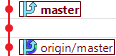
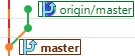
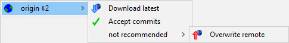
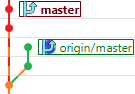
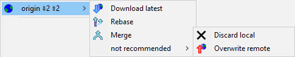

# Collaborating on a moving target

In [an earlier section](../branches/) we discussed what a branch actually was - a name that points to a commit.  When synchronizing with teammates, it is important to also remember the intent behind publishing a branch.  **The purpose of publishing a branch is to synchronize and integrate work around a specific objective**.  You can use your own convention, but the following are common:

* **master** holds the latest working version of the integrated project
* **feature/&lt;feature name&gt;** holds the work-in-progress towards a specific feature

You can use whatever convention you want, but the important thing is that publishing a branch is different than just having one.  If you publish a branch, anyone can download it and move it forward by adding their own commits.  If you also make some improvements on this branch, then you'll have to reconcile your changes with theirs.  This is trivial if the objective of the branch is clear, but it can become difficult if there aren't clear objectives.

## What are remote branches, and how do they work?

**Each time you download from a remote, your repository will have a remote branch placed wherever the equivalent branch is on the remote.**  In the example below, the remote `dummy` is on the left.  As its `test` branch is moved around, the move is reflected on the right each time that a download happens.

If you have a local branch with the same name as the remote branch, then DiffPlug can automatically help you keep these two in sync.  If you right-click a branch (either the local branch or a remote branch), DiffPlug can show you what must be done to synchronize one with the other.

Here are the possible cases:

| Situation                              | Description                                         | Available actions                                      |
|--                                      |--                                                   | --                                                     |
|              | The local and remote branches are synchronized.     |              |
|      | You have a branch that the server doesn't have.     |      |
|    | The server has a branch that you don't have.        |    |
|    | You made some commits and haven't uploaded them yet. |    |
|  | The server has some new commits which you haven't accepted yet. |  |
|         | Both you and the server have some new commits.  Congratulations!  You're going to have to redo your work on top of the new latest version from the team.  Git has a smorgasbord of options available to you, which we cover in the [time travel](../time-travel/) section. |         |

# Warning!  Do not back up!  Severe tire damage!

**A published branch should only move forward.**  Once a branch has been published, anyone might base their work on the contents of that branch.  If you move a branch backwards, then other people who have based their work on the commits in that branch have lost their foundation.

**If you find that you need to remove or undo some changes that have already been published, you should do that [using new commits](../time-travel/apply/).**  This gives you the opportunity to explain in the commit messages why some previously published commits were faulty.  If you move a branch backwards, there's no way to tell your teammates why, so it will be very distressing to them when they find that the commits which they based their work on are gone without any explanation.

At various points, the "not recommended" section will give you the option to move a remote branch backwards.  It can be useful when you're working by yourself and using a remote repository only as a personal backup mechanism.  **If you're working with other people, you should never use the "not recommended" section.**
