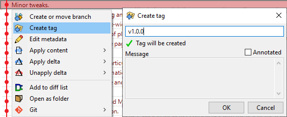

# Permanent branches (a.k.a. tags)

There are lots of ways to move a branch.  This makes them great for tracking a moving target, such as progress on a new feature, but unreliable for keeping track of a fixed instant in time, such as a published release.  That is why git has tags.  Tags work the same way as a branch (a name that points to a commit) - the only difference is that there's no easy way to move them.

There are two kinds of tag, and you can make either one by right-clicking the commit you want to tag.

| Kind of tag | How to make one                                       | What they look like |
| ---         | ---                                                   | ---                 |
| Lightweight |  |  |
| Annotated   |      |  |

## Sharing tags

Collaborating on a fixed target is a little easier than collaborating on a moving target, so tags are a great place to learn about sharing.  To upload a tag, right-click it then `Sync -> Upload to origin`.  This will upload the tag and all of its parent commits to the remote named "origin".

Whenever you upload a tag or branch, git will ensure that every single ancestor commit of the tag or branch also gets uploaded.  This will usually happen very quickly, because git will only have to upload new commits which the server doesn't have yet.

Now, the next time one of your colleagues clicks "Download all" on their repository, they will download this new tag.

## Moving a tag

The only way to move a tag is to delete it and create a new tag with the same name.  **Once you have shared a tag by uploading it to a central repository, you should not move it.**  If you have to move it, you should make a new annotated tag called "oldtagname_updated" with a message describing why it needed to be moved.

Tags are intended to mark a permanent spot in time, so there isn't a good mechanism for moving them.  If you upload a tag, then delete it and upload the same tag in a different spot, it's very likely that some people in your team will have the tag in the first place, while others will have it in the second place.
